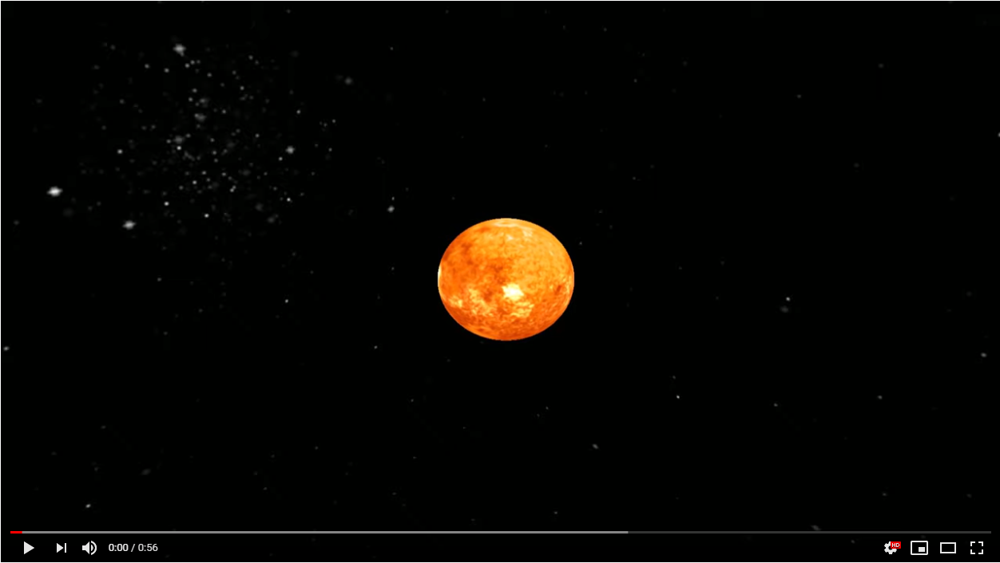

# SOLAR SYSTEM
SolarSystem is rather simplistic visualization of our Solar System.
Planet's position calculation are based on this [publication](https://stjarnhimlen.se/comp/ppcomp.html).
All objects are in relative size and distance to each other, but to manage huge scale of Solar System all distances between planets has been reduced three times.

Programmed with C++17 and modern OpenGL (Core-profile).

### CONTROLS 
* WSAD to move
* MOUSE to rotate
* LEFT SHIFT to move camera faster
* 0 - 8 to focus camera on object
* SCROLL to change camera's distance from observed object
* ARROWS to control time flow
* SPACE to puase/unpasue time
* TAB to change rendering mode

### Showcase

### DEPENDENCIES
* GLFW
* GLAD
* GLM
* Assimp
* STB

### SPECIAL THANKS
* 3D planet model: https://free3d.com/user/printable_models
* Planet textures: https://www.solarsystemscope.com/textures/
* Skybox texture: http://www.custommapmakers.org/skyboxes.php
